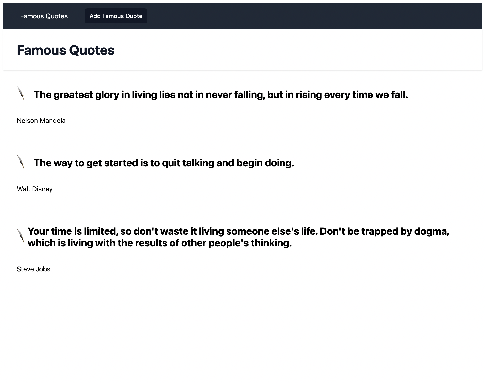
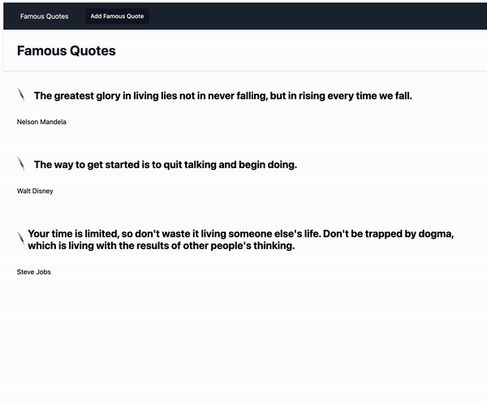
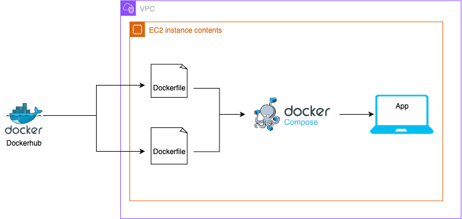

# To run the app locally

```sh
$ yarn
$ yarn start
```

# Github repo

https://github.com/LaraTunc/wcd-4-docker-compose

# Docker hub repo

https://hub.docker.com/r/laratunc/my-app

# Instructions

1. Run `ansible-playbook setup.yml` to create a vpc, public subnet, igw, route table, security group and an ec2 instance in your aws profile (dependency: ansible).
2. Find the Public IPv4 address of the new ec2 instance in your account. It should be named `my_ec2`.
3. On your browser open `http:<public-ipv4-address-of-your-instance>:3000` and you should see my application that says `Famous Quotes`.
   
   

4. To destroy the newly provisioned resources you can run `ansible-playbook destroy.yml`. Do not forget to replace the resource ids with your own.

# Architecture



## Docs Used

- Ansible: https://docs.ansible.com/ansible/latest/index.html
- Docker get started: https://docs.docker.com/get-started/
- Docker multi-platform images: https://docs.docker.com/build/building/multi-platform/
- Docker on ec2: https://www.workfall.com/learning/blog/how-to-install-and-run-docker-containers-on-amazon-ec2-instance/
- Class material used: compose-demo
